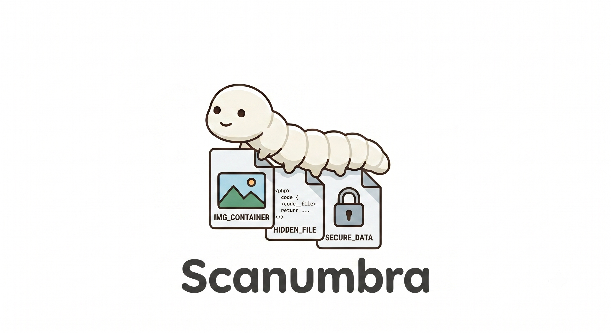

<p align="center">
  
</p>

# Scanumbra
Scanumbra is a lightweight, interactive shell utility designed for steganography, metadata analysis, and file privacy. It centralizes robust tools like ExifTool, Steghide, ImageMagick, and OpenSSL into a single, cohesive command-line interface.
## Features

* **Metadata Inspection**: View hidden file details and EXIF tags using ExifTool.
* **Steganography**: Securely hide or extract data inside image containers using Steghide.
* **Image Conversion**: Transition assets from JPEG to PNG natively via ImageMagick.
* **Symmetric Encryption**: Encrypt and decrypt sensitive files using OpenSSL with AES-256-CBC and PBKDF2 key derivation.
* **Automated Dependency Management**: Automatically detects missing system packages and handles installation seamlessly.

## Prerequisites

The script is tailored for Debian-based distributions and requires the following tools:
* ExifTool
* Steghide
* ImageMagick
* OpenSSL

Umbra will attempt to install these automatically via `apt` upon its first execution if they are missing.

## Installation and Execution

1. Clone or download the repository containing the script.
2. Grant execution permissions to the script:

```bash
chmod +x Scanumbra
